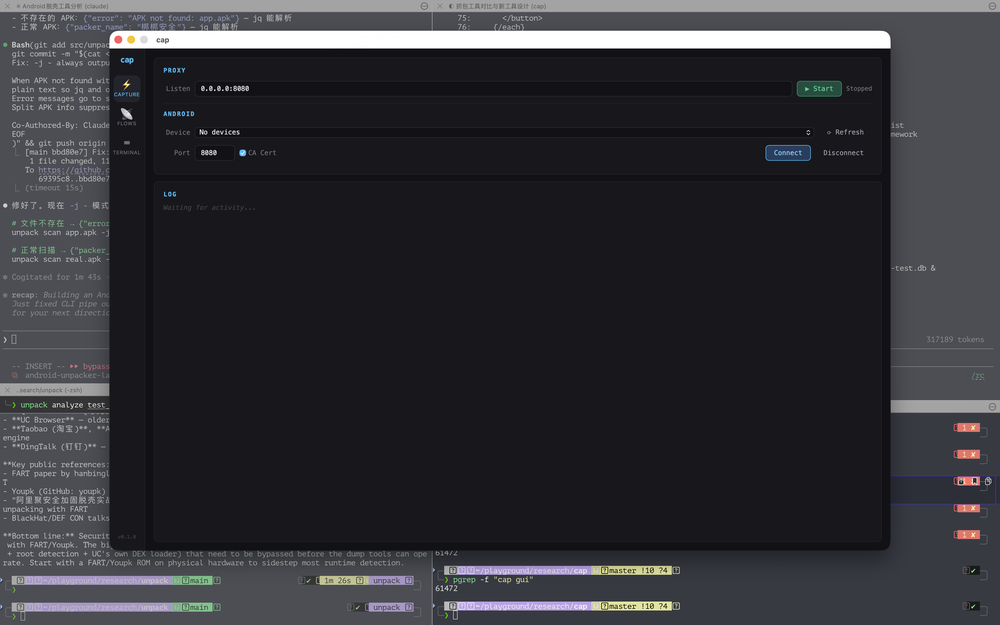
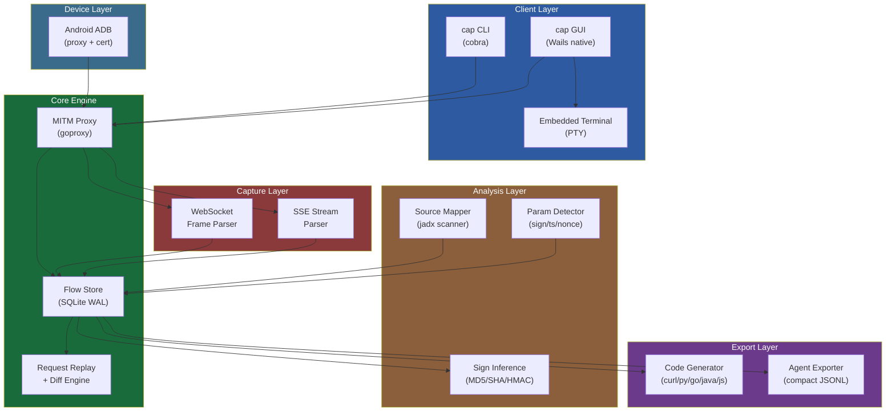
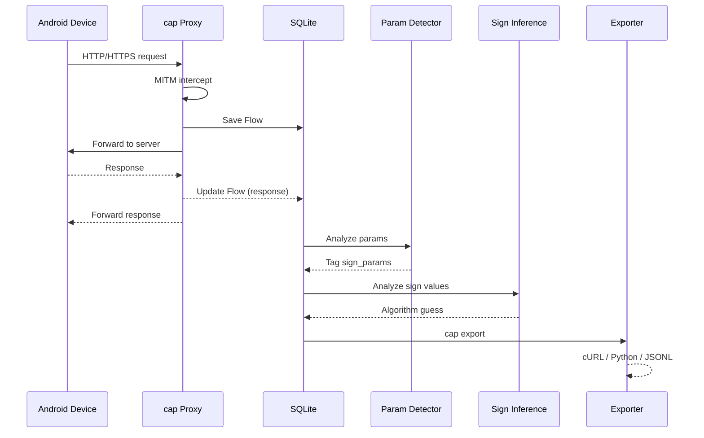
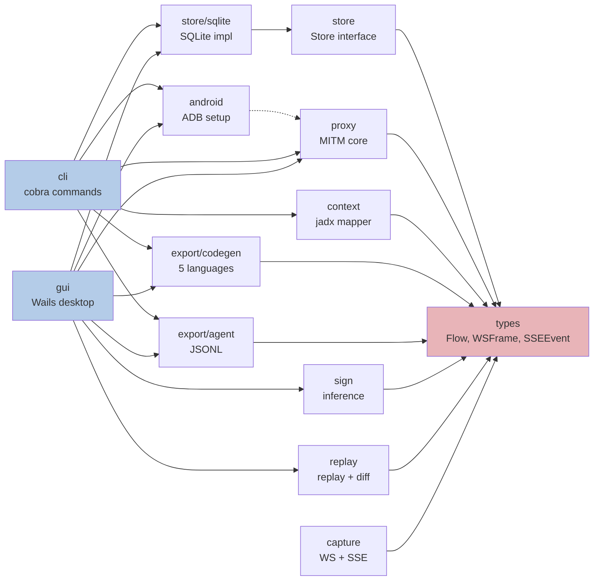

# cap

<p align="center">
  <strong>MITM proxy built for reverse engineering</strong><br>
  LLM-ready output · multi-language codegen · sign algorithm inference · native desktop GUI
</p>

<p align="center">
  <a href="README_CN.md">中文文档</a> ·
  <a href="https://overkazaf.github.io/cap/">Documentation</a> ·
  <a href="#install">Install</a> ·
  <a href="#quick-start">Quick Start</a>
</p>

---

<p align="center">
  
</p>

## Why cap?

Existing tools (Burp Suite, mitmproxy, HTTP Toolkit) are built for web security testing — not for **reverse engineering mobile apps**. Cap fills the gap:

| Capability | Burp Suite | mitmproxy | HTTP Toolkit | **cap** |
|------------|:----------:|:---------:|:------------:|:-------:|
| CLI-first automation | ✗ GUI only | ✓ mitmdump | ✗ GUI only | **✓** |
| Native desktop GUI | ✗ Java/Swing | △ mitmweb (basic) | ✓ Electron | **✓ Wails (native)** |
| LLM/Agent-ready output | ✗ XML/HAR | △ HAR (verbose) | △ HAR | **✓ compact JSONL** |
| Multi-language codegen | ✗ | △ curl + Python | ✗ | **✓ 5 languages** |
| Sign param auto-detect | ✗ | ✗ | ✗ | **✓** |
| Sign algorithm inference | ✗ | ✗ | ✗ | **✓ MD5/SHA/HMAC** |
| Static analysis mapping | ✗ | ✗ | ✗ | **✓ jadx → URL** |
| One-cmd Android setup | ✗ | ✗ | △ app-based | **✓ ADB direct** |
| Cert inject (Android 10+) | ✗ manual | ✗ manual | ✓ | **✓ mount --bind + Magisk** |
| WebSocket capture | ✓ | ✓ | ✓ | **✓** |
| SSE stream capture | ✗ | △ | ✗ | **✓** |
| Request replay + diff | ✓ Repeater | ✗ | ✗ | **✓** |
| Embedded terminal | ✗ | ✗ | ✗ | **✓ multi-tab PTY** |
| Single binary | ✗ JVM | ✗ Python | ✗ Electron | **✓ Go** |
| Open source | ✗ ($449/yr) | ✓ | △ core only | **✓ MIT** |

## Architecture

### System Overview



### Data Flow



### Module Dependency



## Features

### MITM Proxy
- HTTP and HTTPS interception with auto-generated ECDSA CA certificate
- Flow capture: method, URL, headers, body, status, latency
- Noise header stripping (Accept-Encoding, Connection, etc.)
- SQLite persistence with WAL mode for concurrent reads

### Android Integration
Three-strategy CA cert installation for modern Android:
1. **mount --bind** (Android 10+, instant, non-persistent) — HTTP Toolkit approach
2. **Magisk module** (persistent, requires reboot)
3. **Legacy /system remount** (Android 9 and below)

### Multi-Language Code Generation
```bash
cap export --flow f1 --lang curl       # cURL command
cap export --flow f1 --lang python     # requests library
cap export --flow f1 --lang go         # net/http
cap export --flow f1 --lang java       # OkHttp3
cap export --flow f1 --lang js         # fetch API
```

### LLM-Ready Output
```json
{"ts":1696200000,"method":"POST","url":"https://api.com/login","req_headers":{"Content-Type":"application/json"},"req_body":{"user":"test","sign":"a3b2c1"},"status":200,"resp_body":{"token":"eyJ..."},"sign_params":["sign","ts"],"latency_ms":120}
```

- Compact JSONL, one flow per line
- Noise headers stripped
- Sign parameters auto-tagged
- Large bodies truncated with SHA256 hash
- JSON bodies inline as objects (not escaped strings)

### Signature Algorithm Inference
Analyzes `sign` parameters across multiple requests to guess the algorithm:
- Length + encoding analysis (32 hex → MD5, 64 hex → SHA256, etc.)
- Cross-request consistency checking
- Brute-force verification: tries MD5/SHA1/SHA256/HMAC on sorted params
- Common pattern matching (Chinese app API conventions)

### Static Analysis Correlation
```bash
# Scan jadx decompiled output
cap context import --jadx ./jadx-output/

# Captured flows now show source references:
# POST /api/v1/login → com/example/api/LoginApi.java:42 (method: login)
```

Scans for:
- Retrofit annotations (`@POST`, `@GET`, etc.)
- OkHttp `Request.Builder` patterns
- Maps URL patterns to source file, class, method, and line number

### Desktop GUI
Native Wails-based desktop app (single binary, no Electron):
- **Capture tab**: proxy start/stop + Android device connect
- **Flows tab**: filterable table + detail panel + inline code export
- **Terminal tab**: multi-tab embedded shell (PTY)
- 4 color themes: Dark, Light, Mocha (Catppuccin), Nord

## Install

```bash
# From source (recommended)
git clone https://github.com/overkazaf/cap.git
cd cap
go build -o cap ./cmd/cap

# Or via go install
go install github.com/overkazaf/cap/cmd/cap@latest
```

**Requirements**: Go 1.21+, macOS or Linux (for Wails GUI: Xcode CLI tools on macOS)

## Quick Start

```bash
# 1. Start proxy (listens on all interfaces)
cap start -a 0.0.0.0:8080

# 2. Connect Android device
cap android connect

# 3. Use the phone — traffic flows through cap

# 4. View captured requests
cap flows

# 5. Export for analysis
cap export --flow f1 --lang all        # code in 5 languages
cap export --format agent | llm chat   # feed to your LLM

# 6. Or use the GUI
cap gui
```

## Project Structure

```
internal/
├── types/          Flow, WSFrame, SSEEvent structs
├── proxy/          goproxy MITM, CA cert gen, header filter
├── store/sqlite/   SQLite with WAL, filtering, JSON codec
├── export/
│   ├── codegen/    Go templates → curl/python/go/java/js
│   └── agent/      Compact JSONL + sign param detection
├── android/        ADB device setup, 3-strategy cert install
├── context/        jadx scanner, Retrofit/OkHttp parser, URL matcher
├── sign/           Length analysis, pattern matching, brute-force verify
├── replay/         HTTP replay, request modification, response diff
├── capture/        WebSocket frame parser, SSE stream parser
├── cli/            Cobra commands: start/flows/export/android/gui
└── gui/            Wails tabs: capture, flows, terminal, theme system
```

## License

MIT

## Contributing

Issues and PRs welcome. See [CONTRIBUTING.md](CONTRIBUTING.md) for guidelines.
