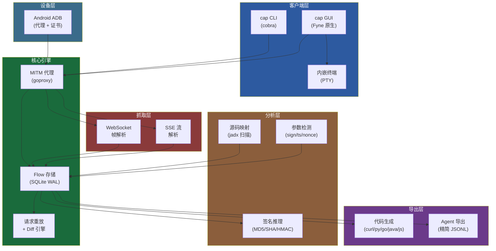
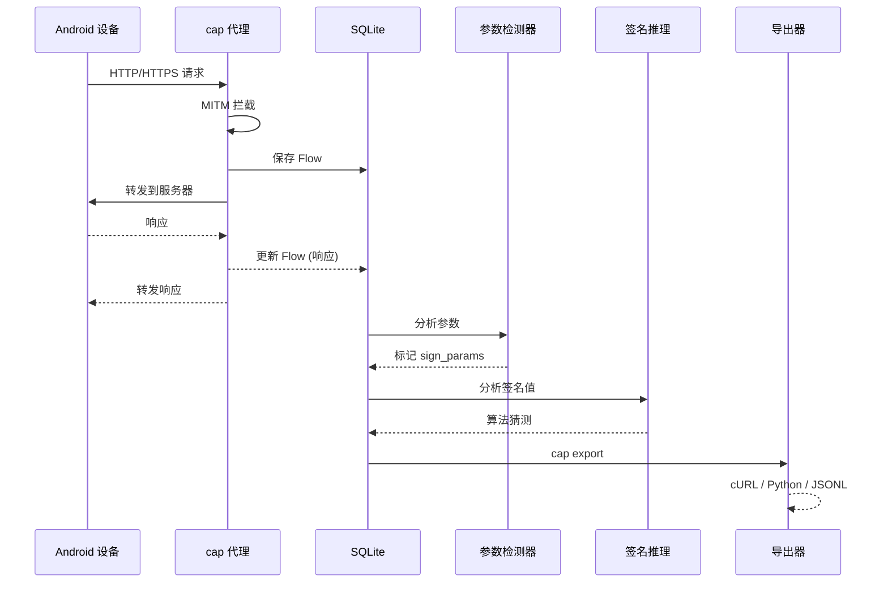

# cap

<p align="center">
  <strong>为逆向工程打造的 MITM 抓包工具</strong><br>
  LLM 友好输出 · 多语言代码生成 · 签名算法推理 · 原生桌面 GUI
</p>

<p align="center">
  <a href="README.md">English</a> ·
  <a href="https://overkazaf.github.io/cap/">文档站</a> ·
  <a href="#安装">安装</a> ·
  <a href="#快速开始">快速开始</a>
</p>

---

## 为什么选择 cap？

现有工具（Burp Suite、mitmproxy、HTTP Toolkit）都是为 Web 安全测试设计的，不是为**逆向工程移动端 App** 设计的。cap 填补了这个空白：

| 能力 | Burp Suite | mitmproxy | HTTP Toolkit | **cap** |
|------|:----------:|:---------:|:------------:|:-------:|
| CLI 自动化 | ✗ 纯 GUI | ✓ mitmdump | ✗ 纯 GUI | **✓** |
| 原生桌面 GUI | ✗ Java/Swing | △ mitmweb (简陋) | ✓ Electron (重) | **✓ Fyne (原生)** |
| LLM/Agent 友好输出 | ✗ XML/HAR | △ HAR (冗余) | △ HAR | **✓ 精简 JSONL** |
| 多语言代码生成 | ✗ | △ curl + Python | ✗ | **✓ 5 种语言** |
| 签名参数自动识别 | ✗ | ✗ | ✗ | **✓** |
| 签名算法推理 | ✗ | ✗ | ✗ | **✓ MD5/SHA/HMAC** |
| 静态分析关联 | ✗ | ✗ | ✗ | **✓ jadx → URL 映射** |
| 一键连接 Android | ✗ | ✗ | △ 需装 App | **✓ ADB 直连** |
| 证书注入 (Android 10+) | ✗ 手动 | ✗ 手动 | ✓ | **✓ mount --bind + Magisk** |
| WebSocket 抓取 | ✓ | ✓ | ✓ | **✓** |
| SSE 流抓取 | ✗ | △ | ✗ | **✓** |
| 请求重放 + Diff | ✓ Repeater | ✗ | ✗ | **✓** |
| 内嵌终端 | ✗ | ✗ | ✗ | **✓ 多 Tab PTY** |
| 单文件分发 | ✗ JVM | ✗ Python | ✗ Electron | **✓ Go 单二进制** |
| 开源免费 | ✗ ($449/年) | ✓ | △ 核心开源 | **✓ MIT** |

## 架构

### 系统总览



### 数据流



## 核心功能

### MITM 代理
- HTTP/HTTPS 中间人拦截，自动生成 ECDSA CA 证书
- 完整抓取：方法、URL、请求头、请求体、响应、延迟
- 自动剥离噪声头（Accept-Encoding、Connection 等）
- SQLite 持久化，WAL 模式支持并发读

### Android 集成
三策略 CA 证书注入，适配现代 Android：
1. **mount --bind**（Android 10+，即时生效，非持久化）— HTTP Toolkit 方案
2. **Magisk 模块**（持久化，需重启）
3. **Legacy /system 挂载**（Android 9 及以下）

### 多语言代码生成
```bash
cap export --flow f1 --lang curl       # cURL 命令
cap export --flow f1 --lang python     # requests 库
cap export --flow f1 --lang go         # net/http
cap export --flow f1 --lang java       # OkHttp3
cap export --flow f1 --lang js         # fetch API
```

### LLM 友好输出
```json
{"ts":1696200000,"method":"POST","url":"https://api.com/login","req_headers":{"Content-Type":"application/json"},"req_body":{"user":"test","sign":"a3b2c1"},"status":200,"resp_body":{"token":"eyJ..."},"sign_params":["sign","ts"],"latency_ms":120}
```

- 精简 JSONL，每行一个请求
- 噪声头已剥离
- 签名参数自动标记
- 大 body 截断 + SHA256 哈希
- JSON body 内联为对象（非转义字符串）

### 签名算法推理
分析多个请求中的 `sign` 参数，猜测生成算法：
- 长度 + 编码分析（32 hex → MD5，64 hex → SHA256 等）
- 跨请求一致性检查
- 暴力验证：对排序参数尝试 MD5/SHA1/SHA256/HMAC
- 匹配常见签名模式（国内 App API 惯例）

### 静态分析关联
```bash
cap context import --jadx ./jadx-output/
# 抓到的请求会显示源码位置：
# POST /api/v1/login → com/example/api/LoginApi.java:42 (method: login)
```

### 桌面 GUI
基于 Fyne 的原生桌面应用（单二进制，非 Electron）：
- **Capture 标签**：代理启停 + Android 设备连接
- **Flows 标签**：可过滤表格 + 详情面板 + 内联代码导出
- **Terminal 标签**：多 Tab 内嵌终端 (PTY)
- 4 种配色主题：Dark、Light、Mocha (Catppuccin)、Nord

## 安装

```bash
# 从源码构建（推荐）
git clone https://github.com/overkazaf/cap.git
cd cap
go build -o cap ./cmd/cap

# 或通过 go install
go install github.com/overkazaf/cap/cmd/cap@latest
```

**环境要求**：Go 1.21+，macOS 或 Linux（GUI 需要 Xcode 命令行工具）

## 快速开始

```bash
# 1. 启动代理
cap start -a 0.0.0.0:8080

# 2. 连接 Android 手机
cap android connect

# 3. 操作手机 — 流量自动经过 cap

# 4. 查看抓到的请求
cap flows

# 5. 导出分析
cap export --flow f1 --lang all        # 5 种语言代码
cap export --format agent | pbcopy     # 喂给 LLM

# 6. 或者用 GUI
cap gui
```

## 命令参考

| 命令 | 说明 |
|------|------|
| `cap start` | 启动 MITM 代理 |
| `cap start -a 0.0.0.0:9090` | 指定监听地址 |
| `cap flows` | 列出抓到的请求 |
| `cap flows --host example.com` | 按域名过滤 |
| `cap flows --format json` | JSON 输出 |
| `cap export --flow f1 --lang curl` | 导出为 cURL |
| `cap export --format agent` | LLM 友好 JSONL |
| `cap android connect` | 一键连接 Android |
| `cap android disconnect` | 断开设备 |
| `cap gui` | 启动桌面 GUI |

## 协议

MIT
